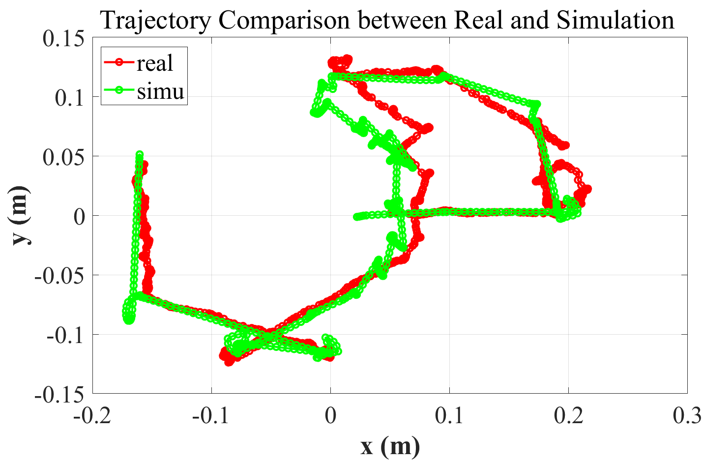

# EPFL_ROS_Practicals_Project

| **Test passed**                                              |
| ------------------------------------------------------------ |
|      |

> [MICRO-453 Robotics practicals](https://edu.epfl.ch/coursebook/fr/robotics-practicals-MICRO-453), 2021 Spring
>
> **Students: [Chuanfang Ning](https://github.com/Chuanfang-Neptune), [Jianhao Zheng](https://github.com/Jianhao-zheng), Yujie He**
>
> **Example page**: https://go.epfl.ch/ros_basics_final_2021
>
> :star: **2021/04: Update our project [report](./ROS_Basics_Report_21Spring.pdf) !**

## :key: Keywords

Thymio, PID, Way following, Obstacle avoidance, Pledge algorithm, Aruco marker, Sim2Real, Gazebo

## :hammer: How to use?

- visualize Thymio in RViz

  ```shell
  roslaunch ros_basics_exercise thymio_simple_rviz.launch
  ```

- simulate Thymio robot in Gazebo with an interactive window

  ```shell
  roslaunch ros_basics_control simu_thymio.launch
  ```

- adding waypoints and obstacle for the robot

  ```shell
  roslaunch ros_basics_control simu_thymio.launch
  roslaunch ros_basics_exercise set_simu_waypoints_obstacle.launch
  ```

- tune with rqt tools (rqt_plot, rqt_reconfigrure, rqt_image_show)

  ```shell
  roslaunch ros_basics_control simu_thymio.launch
  roslaunch ros_basics_exercise tune_with_rqt.launch
  ```

- visualize the rosbag files

  ```shell
  roslaunch ros_basics_exercise view_with_rosbag.launch
  ```

- extract pose and sensor information from rosbag files

  ```shell
  roslaunch ros_basics_exercise view_with_rosbag.launch
  # open a new terminal
  rosrun ros_basics_exercise topic_reader.py
  ```

- plot trajectory comparison between real and simulation (using matlab)

  ```shell
  cd results_from_bag/
  # run `plot_traj_comp.m` in MATLAB
  ```

  

- connect to the real Thymio

  ```shell
  pip install thymiodirect
  roslaunch ros_basics_control real_thymio.launch
  ```

## :school_satchel:Example rosbag files

> rosbags can be downloaded from [Google Drive](https://drive.google.com/drive/folders/19KUzVqVasN7F2TfLpSc37OlQIdFQcbJs?usp=sharing)

For more info, you can refer to [**readme.md** in ./src/ros_basics_exercise/rosbags/](./src/ros_basics_exercise/rosbags/readme.md) folder.

## :star: Acknowledgement

Thanks to Vaios Papaspyros and Rafael Barmak from MOBOTS at EPFL for the amazing course tutorials !
